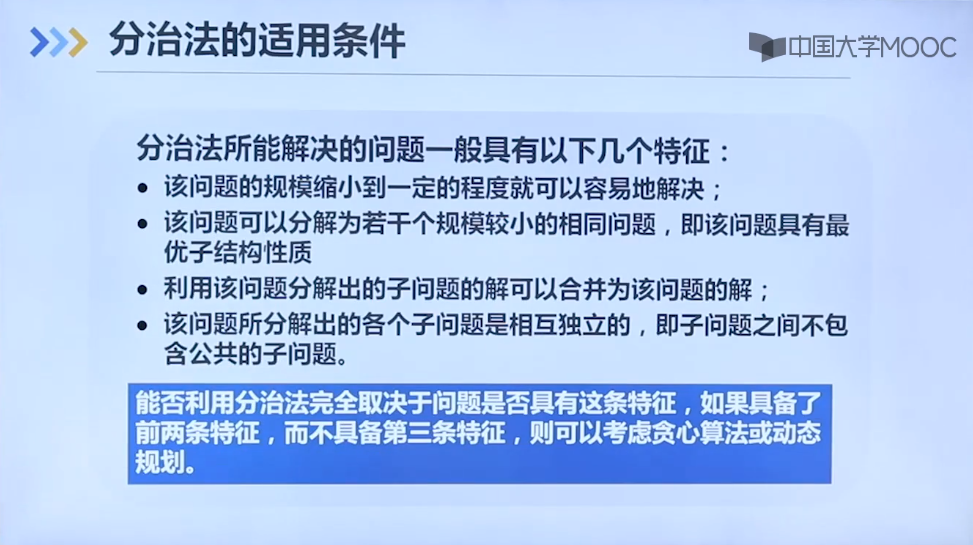

##递归的解决思路
将n规模的问题转化成n-1规模的问题，找到递归出口（一般来说为n=1，2的时候），然后回推。
###典型例题
汉诺塔问题：（移动盘子，小的在上，大的在下）
求解一个数组中出现次数超过一半的“众数”问题：
````js
var majorityElement = function (nums) {
  // 统计数组 nums 的区间 [start, end] 中，num 出现的次数。
  const countInRange = (start, end, num) => {
    let count = 0;
    for (let i = start; i <= end; i++) {
      if (nums[i] === num) count++;
    }
    return count;
  };

  // 获取数组 nums 的区间 [start, end] 中的众数。
  const majorityElementRec = (start, end) => {
    if (start === end) return nums[start];

    // 细分区间数为一，找众数
    let mid = start + Math.floor((end - start) / 2);
     // 左侧子区间的众数
    const l_majority = majorityElementRec(start, mid);
     // 右侧子区间的众数
    const r_majority = majorityElementRec(mid + 1, end);
    if (l_majority === r_majority) return l_majority;

    // 合并区间，找众数，分治的标志性特征==》合并子问题的解得到答案
    const l_count = countInRange(start, end, l_majority);
    const r_count = countInRange(start, end, r_majority);
    return l_count > r_count ? l_majority : r_majority;
  };

  return majorityElementRec(0, nums.length - 1);
};
````
###特征
问题规模缩小时容易解决
该问题可分解为若干个相同的较小规模的的问题
子问题的解可以合并成原问题的解（与贪心算法、动态规划的区别）
